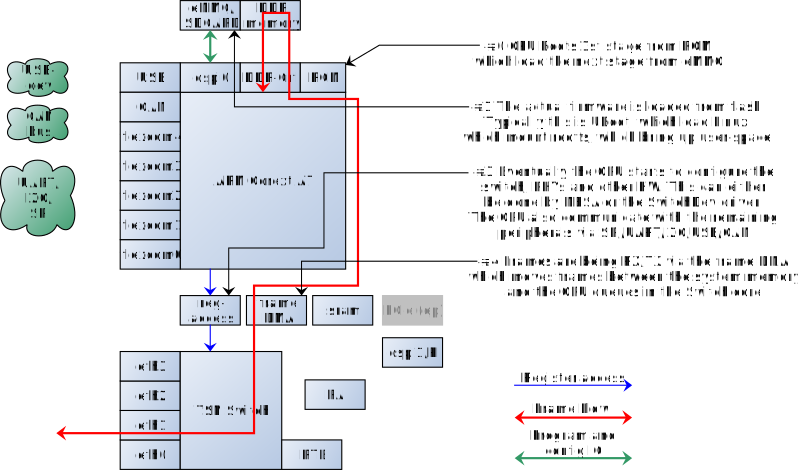
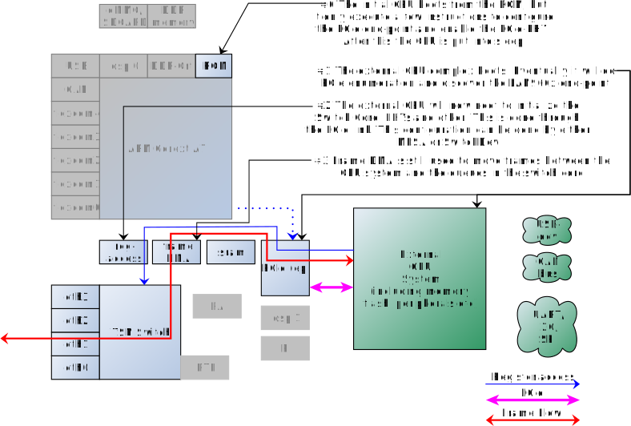
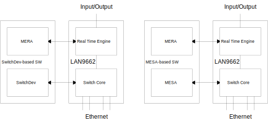
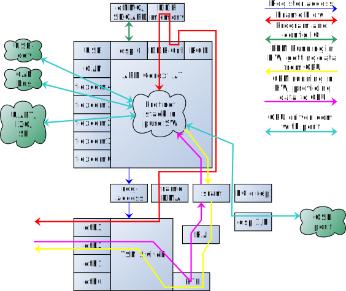
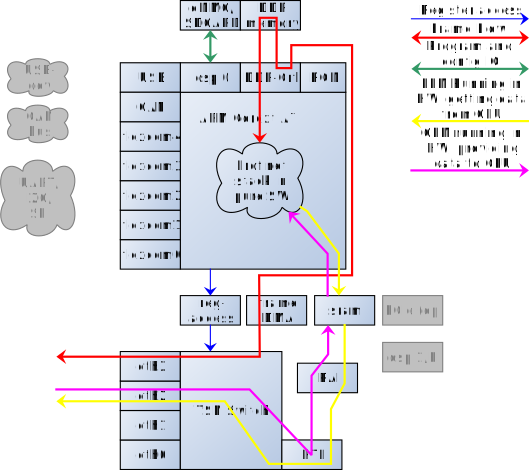
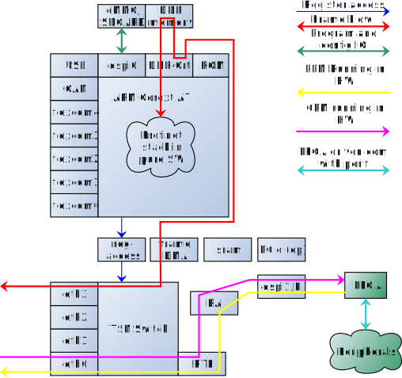
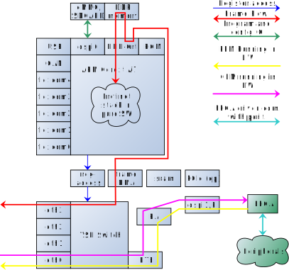
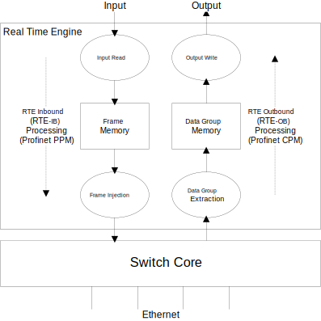

// Copyright (c) 2004-2020 Microchip Technology Inc. and its subsidiaries.
// SPDX-License-Identifier: MIT

:sectnumlevels: 5
:toclevels: 5

= Introduction

== Introduction

The Microchip Ethernet RTE API (MERA) is used to control the Real Time Engine (RTE)
of the LAN9662 device. The RTE is a HW component closely integrated with the TSN switch.
It offers HW-offload of the lower protocol layers of Profinet (PN) Real-Time Cyclic (RTC)
and OPC Unified Architecture - Publisher/Subscriber (OPC UA PubSub, Part 14).

The Switch Core part of the device must be setup to control switching between Ethernet
ports, and classification of frames to Real Time Protocol Data Unit (RTP) IDs needed by the RTE.
Two software solutions are available for this purpose:

* SwitchDev driver for Linux.
* Microchip Ethernet Switch API (MESA) for Linux or another OS.

== Supported operating systems

MERA is an OS agnostic C library providing a high-level API over the register
interface provided by HW. MERA can be used in pretty much any OS which can
offers basic register access and a 1-second call-back function. MERA is MIT
licensed allowing it to be used in open-source licensed systems and proprietary
systems.

The testing and demonstrations is done using a Linux system where MERA runs in
user-space accessing registers via UIO driver.

== LAN9662

LAN9662 SOC is a TSN bridged end-point with the RTE and a ARM Cortex A7
integrated. The LAN9662 SoC also offers a PCIe end-point, allowing an external
CPU to use the switch core and the RTE. The internal CPU and external CPUs are
mutual exclusive.

The following figure shows the scenario using the internal CPU:

{empty} +

When an external CPU is connected via PCIe, the switch core, RTE and SRAM still
works in the same way. The FDMA operates slightly different, but this is hidden
in the driver. This is shown below:

IMPORTANT: The above illustrations does not include all periphereals and blocks
included in the LAN9662 SOC. The illustration only tries to highlight changes
when using an external CPU vs internal.

MERA, MESA, SwitchDev and all the use-cases presented in this document is
supported using an internal or external CPU over PCIe. Access to certain
peripherals such as USB Host/device is only possible using the internal CPU, an
external CPU is expected to provide the needed peripherals.

The link:#docs/switch_core[Switch Core] part of the device must be
setup to control switching between Ethernet ports as well as classification of
frames to Real Time Protocol Data Unit IDs needed by the RTE. Two mutually exclusive
software solutions are available for this purpose:

* SwitchDev driver for Linux (left side of the diagram).
* Microchip Ethernet Switch API (MESA) for Linux or another OS (right side of the diagram).

NOTE: The SwitchDev driver uses Device-Trees to provide all the board
configurations. If a BIOS/UEFI (x86, x86-64/AMD64) based external CPU system is
considered, then some integration effort is needed if the SwitchDev will be used
to control the switch-core.

=== Evaluation boards

TODO

== Profinet and RTE

The RTE offers HW facilities to offload the RTC traffic, which is the most
real-time critical, band-bandwidth and processing demanding part of the Profinet
traffic. The RTE HW alone will however not offer a fully complaint Profinet
stack, to provide this additional SW components are needed.

The following table provides an overview of what protocol is needed to build a
Profinet system.

[cols="1,1,1,5",options="header"]
|===
| Ether-type | Name                    | HW Support | Notes
| 0x0800     | IP, UDP, ICMP and SNMP  | No         | This is provided by the IP stack and friends

| 0x0806     | ARP                     | No         | Part of the IP stack

| 0x8100     | VLAN                    | Yes/Bridge
| The integrated switch provides the needed offload. Note: the usage of VLANs are very different in CC-A/B and CC-D.

| 0x8892     | PROFINET                | Yes/RTE
| This is an umbrella of many protocols.  The FrameID identify the next protocol. See the following table for more details.

| 0x88F7     | 802.1AS / gPTP          | Yes/Bridge
| The switch offers time-stamps and PTP-clocks, but requires a PTP application to run the protocol.  This is only needed in CC-D.

| 0x88CC     | LLDP                    | No
| Additional TLVs added by profinet.

| 0x88E3     | MRP                     | Yes/Bridge | This is the Media Redundancy protocol.

| 0xB62C     | OPC UA                  | Yes/RTE    | PublisherId/WriterGroupId (the equivalent of FrameID)

|===

The following description takes its offset in a PROFINET application.
OPC UA PubSub is supported similarly, but uses different terms.
The following table provides an overview of the FrameIDs and the sub-protocols
defined in 0x8892/PROFINET.

[cols="2,1,1,4",options="header"]
|===
| Frame ID   | Name | HW Support | Notes

| 0x0020, 0x0080, 0xFF00-0xFF20, 0xFF40-0xFF43
| PTCP
| No
| Profinets own (legacy) time synchronization protocol.

| 0x0100-0x0FFF, 0x8000-0xBFFF
| RTC
| Yes/RTE
| This is the portion of the Profinet protocol offloaded by the RTE and MERA library.

| 0xC000-0xFBBB | RTC over UDP | No |

| 0xFC01-0xFE01 | Alarms | No |
| 0xFE02        | RSI    | No | Remote Service Interface - a RPC protocol
| 0xFEFC-0xFEFF | DCP    | No | Profinet Discovery Protocol
| 0xFF80-0xFF8F | FRAG   | No | Fragmentation protocol

|===

This document will focus on the portion offloaded by the RTE being controlled
by the MERA Library.

=== PN/RTC options

The RTC traffic can be considered as the data-plane of Profinet. Profinet
defines 2 state-machines: Provider Protocol Machine (PPM) and Consumer
Protocol Machine (CPM) which operates on the RTC traffic. The PPM and CPM are
shared functionality in both devices and controllers (PLCs). See IEC 61158-6-10.

This means that the RTE/MERA supports both devices and controllers, in
additional to that it also supports controllers with local IO (a hybrid of the
2).

As an other dimension to this, the RTE/MERA can be configured to either process
data between the Profinet/Ethernet frames and a buffer system towards a CPU, or
a between the Profinet/Ethernet frames and some peripherals connected via
QSPI/PI.

This adds up to 4 combinations which is described in the table below:

[cols="6,1,1",options="header"]
|===
|Description  | IOD and/or Drive | IOC
| PPM/CPM offloaded. CPU in data-path, either doing calculations or talking with
peripherals. In this mode the HW will do the frame RX/TX at the network-cycle
time, and only interrupt the CPU with the checked PROFINET data at the
application cycle time.
| *IOD-RTE-CPU*
| *IOC-RTE-CPU*

| PPM/CPM offloaded. CPU not in data-path. The cyclic data is fully offloaded to
HW, and CPU is only doing initial configuration and monitoring. In this mode
the HW "bridge" PROFINET data between the PROFINET frames and a QSPI/PI
interface which must be connected to the peripherals.
| *IOD-RTE-FULL*
| *IOC-RTE-FULL*

|===

The names in bold: *IOD-RTE-CPU*, *IOC-RTE-CPU*, *IOD-RTE-FULL*, *IOC-RTE-FULL*
is used to identify each of the 4 modes. The following sub-sections describe the
individual modes in more details.

==== IOD-RTE-CPU

* This is a PROFINET Device, with the PPM/CPM state-machines offloaded to HW
* CPM/PPM in HW, but data goes to CPU
** A 3-buffer system is defined to allow race-free exchange of date between HW
and SW
** SW is only interrupted at the application cycle
** The interaction with peripherals (sensors/actuators/motor/gpio) is done by
SW.
* Advantage:
** The bulk of traffic and interrupts are offloaded to HW.
*** Only valid RTE data, only the needed portion of the frame, and only the
frequency defined by the application cycle goes to SW.
** The real-time requirements are softened, as the network cycle is handled by
HW
** The interaction with peripherals is done by SW and thereby very flexible. No
need for FPGA to do interface adaption.
* Disadvantage:
** Slightly harder to implement and integrate in existing SW stack as it needs
knowledge about the RTE HW.

==== IOC-RTE-CPU

* This is a PROFINET PLC, with the PPM/CPM state-machines offloaded to HW
* CPM/PPM in HW, but data goes to CPU
** A 3-buffer system is defined to allow race-free exchange of date between HW
   and SW
** SW is only interrupted at the application cycle
** PLC calculations are still done in the CPU, and real-time requirements are
   present.
* Advantage:
** The bulk of traffic and interrupts are offloaded to HW.
*** Only valid RTE data, only the needed portion of the frame, and only the
    frequency defined by the application cycle goes to SW.
** The real-time requirements are softened as the network cycle is handled by HW
* Disadvantage:
** Slightly harder to implement and integrate in existing SW stack, as it needs
   knowledge about the RTE HW.

==== IOD-RTE-FULL

* This is a PROFINET Device with cyclic real-time data running completely in
HW.
* PPM/CPM is running in HW, with mapping of data-set in the PDU to addresses in
the memory mapped QSPI1/PI space
** This mapping is configured by SW, and the time-critical operations are done
by HW.
** SW is still needed to implement the remaining part of the PROFINET stack
(non-RTC FrameIDs) and other associated protocols.
* Advantage:
** CPU is not in the data-path and will not become a bottleneck. This allows
very short cycle times and very high band-width
* Disadvantage:
** Will most likely require an FPGA to do the interface adaptation, as the
QSPI/PI transaction is generated by HW.
** May be harder to integrate in some SW stacks
*** This depends a lot on the details of the give SW stack

==== IOC-RTE-FULL

* This is a PROFINET Controller with cyclic real-time data running completely
in HW.
** PLC calculations are done in FPGA
* PPM/CPM is running in HW, with mapping of data-set in the PDU to addresses in
the memory mapped QSPI1/PI space
** This mapping is configured by SW, and the time-critical operations are done
by HW.
** SW is still needed to implement the remaining part of the PROFINET stack
(non-RTC FrameIDs) and other associated protocols.
* Advantage:
** CPU is not in the data-path and will not become a bottleneck. This allows
very short cycle times and very high bandwidth
* Disadvantage:
** PLC programs needs to be implemented in external FPGA/CPU/DSP
** May be harder to integrate in some SW stacks
***  This depends a lot on the details of the give SW stack

== RTE Overview

The RTE processing can be divided in two directions:

* RTE Outbound (RTE-OB): Frames received on network ports and classified to an RTP ID by
the Switch Core are processed, and the extracted data is stored in the Data Group memory.
Write Action Lists can be setup to transfer Data Groups to Outputs.

* RTE Inbound (RTE-IB): Read Action Lists can be setup to transfer Input data to Frame Memory.
 Frames can be sent to network ports periodically based on configured timers.

