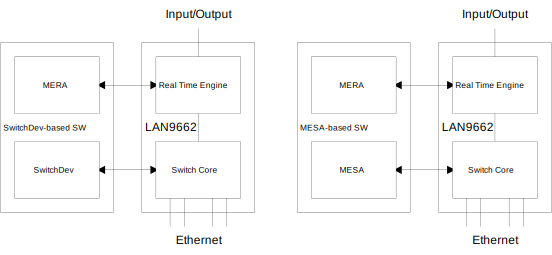

// Copyright (c) 2004-2020 Microchip Technology Inc. and its subsidiaries.
// SPDX-License-Identifier: MIT

:sectnumlevels: 5
:toclevels: 5

= Introduction to MERA

== Introduction

// AWN-COMMENT: I'm missing some even higher level introduction on how this can
// be used at a system level. Maybe we need a dedicated section with this.
//
// Device vs PLC use-cases
// PLC with local IO
//
// Something to understand the systems using QSPI/PI, SRAM and PCIe

The Microchip Ethernet RTE API (MERA) can be used to control the Real Time Engine (RTE)
of the LAN9662 device. Supported Real Time Protocols are Profinet (PN) and OPC Unified
Unified Architecture, part 14: PubSub (OPC-UA).

The Switch Core part of the device must be setup to control switching between Ethernet
ports as well as classification of frames to Real Time Protocol IDs needed by the RTE.
Two software solutions are available for this purpose:

* SwitchDev driver for Linux (left side of the diagram).
* Microchip Ethernet Switch API (MESA) for Linux or another OS (right side of the diagram).

== RTE Overview

The RTE transfers data between the network ports and Inputs/Outputs, which may be:

* SRAM: Memory inside the device accessed using a 3-buffer system.
* QSPI: Quad Serial Peripheral Interface.
* PI: Parallel Interface.
* PCIe: Peripheral Component Interconnect Express.

The RTE processing can be divided in two directions:

* RTE Outbound (RTE-OB): Frames received on network ports and classified to an RTP ID by
the Switch Core are processed, and the extracted data is stored in the Data Group memory.
Write Action Lists can be setup to transfer Data Groups to Outputs.

* RTE Inbound (RTE-IB): Read Action Lists can be setup to transfer Input data to Frame Memory.
 Frames can be sent to network ports periodically based on configured timers.

image::./rte.svg[align=center]
