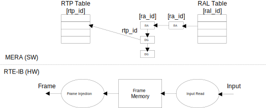

// Copyright (c) 2004-2020 Microchip Technology Inc. and its subsidiaries.
// SPDX-License-Identifier: MIT

:sectnumlevels: 5
:toclevels: 5

= RTE Inbound

== RTE Inbound Overview
The MERA model for controlling RTE-IB is shown below and described in the following
sections.

* The RTP table holds entries describing RTP frames to be transmitted.
* On the input side, each entry in the Read Action List (RAL) table has a configurable
timer.
* Read Action (RA) entries added to a RAL specify the source address and length of the
input data.
* Each RA entry has a list of Data Group (DG) entries with the RTP ID and PDU offset.

== RTP Table
The RTP table in RTE-IB is setup using `mera_ib_rtp_conf_set()`. Each entry is setup with
the type (`mera_rtp_type_t`) and mode (`mera_rtp_ib_mode_t`). Two modes are supported:

* `MERA_RTP_IB_MODE_INJ`: Frames are injected to a specific egress port periodically based
on a timer.
* `MERA_RTP_IB_MODE_OTF`: Received frames classified for RTP-IB processing are modified
On-the-Fly and forwarded.

The frame length for the RTP entry is used to allocate a block in the frame memory and fill
this out with default data. Data can be manually written to the frame using
`mera_ib_rtp_data_set()`.

== Read Action List Table
Transfers of data from Input is controlled using a Read Action List table. Each list has a
timer, which is setup using `mera_ib_ral_conf_set()`.

If the data is read from SRAM, a 3-buffer system is used. For that purpose, functions are
available to request/release a write buffer, `mera_ib_ral_req()`/`mera_ib_ral_rel()`.

== Read Action List
Read Action entries are used to read data from an input address (`mera_ib_ra_add()`). Each
entry is identified by a RA ID (`mera_ib_ra_id_t`), which must be unique for the RAL.

Writing of data to the frame memory can be disabled/enabled using `mera_ib_ra_ctrl_set()`.

== Data Group List
For each Read Action, a number of DG entries can be added using `mera_ib_dg_add()`. Each
entry holds the RTP ID and PDU offset used to update the frame memory. It is possible to
enable automatic update of frame fields at specified offsets:

* PN IOPS
* OPC-UA DataSetFlags1
* OPC-UA MessageSequenceNumber
* OPC-UA StatusCode/Severity

== Counters
Counters for a given RTP ID are available via `mera_ib_rtp_counters_get()`.

== RTE-IB Flush
The entire RTE-IB configuration can be flushed using `mera_ib_flush()`. This will release
the allocated frame memory and revert to RTE-IB default configuration.

== API Function List
`mera_ib_rtp_conf_get()` +
`mera_ib_rtp_conf_set()` +
`mera_ib_rtp_data_set()` +
`mera_ib_ral_conf_get()` +
`mera_ib_ral_conf_set()` +
`mera_ib_ral_req()` +
`mera_ib_ral_rel()` +
`mera_ib_ra_init()` +
`mera_ib_ra_add()` +
`mera_ib_ra_ctrl_set()` +
`mera_ib_dg_init()` +
`mera_ib_dg_add()` +
`mera_ib_flush()` +
`mera_ib_rtp_counters_get()` +
`mera_ib_rtp_counters_clr()`

