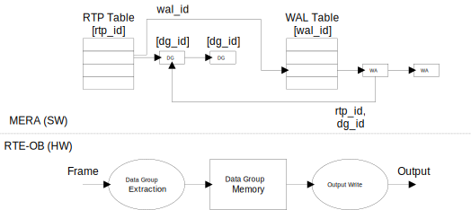

// Copyright (c) 2004-2020 Microchip Technology Inc. and its subsidiaries.
// SPDX-License-Identifier: MIT

:sectnumlevels: 5
:toclevels: 5

= RTE Outbound

== RTE Outbound Overview

The MERA model for controlling RTE-OB is shown below and described in the following
sections. Received frames may contain pieces of data named Data Groups (DGs).

* Data Group Extraction:
** The classified RTP ID of a received frame is used to lookup an RTP entry.
** Each RTP entry has a list of DG entries with the offset and length of the frame
data to copy to DG memory.
* Output Write:
** Each entry in the Write Action List (WAL) table has a configurable timer.
** Write Action (WA) entries added to a WAL specify the destination address of the output
data.

== RTP Table
Received frames are classified to an RTP ID (`mera_rtp_id_t`) by the Switch Core.
The RTP table in RTE-OB is setup using `mera_ob_rtp_conf_set()`. Each entry is setup with
the RTP type (`mera_rtp_type_t`) and the expected PDU length. It is also possible to enable
a WAL ID, which is triggered when a matching frame is received. The status of the entry 
can be retrieved using `mera_ob_rtp_status_get()`.

Each RTP entry can be setup with a timer and a counter specifying the number of timeouts
before the RTP entry is stopped. The entry can be activated again using `mera_ob_rtp_state_set()`.
When an RTP entry is stopped, Write Actions mapping to the entry will use default data.

Each RTP entry can also be mapped to an RTP Group ID (`mera_rtp_grp_id_t`). If the RTP entry
is stopped, the RTP Group is also stopped until activated using `mera_ob_rtp_grp_state_set()`. 
When an RTP group is stopped, the following is done:

* Write Actions mapping to the group will use default data.
* Inbound RTP entries mapping to the group are stopped.

== Data Group List
Each DG entry in RTE-OB is identified by a DG ID (`mera_ob_dg_id_t`), which must be unique
for each RTP entry. DG entries are added to an RTP using `mera_ob_dg_add()`. Each entry is
setup with the PDU offset and length of the data to be copied to the DG memory block 
allocated for the DG. Depending on the RTP type, it is possible to enable DG checks, which
must pass before the data is considered valid:

* PN IOPS
* OPC-UA DataSetFlags
* OPC-UA MessageSequenceNumber
* OPC-UA StatusCode/Severity

The status of the DG checks can be retrieved using `mera_ob_dg_status_get()`.

Writing of data to the DG memory can be disabled/enabled using `mera_ob_dg_ctrl_set()`.
If disabled, data can be manually written into the DG memory with `mera_ob_dg_data_set()`.

== Write Action List Table
Transfer of data to Output is controlled using a Write Action List table. Each list has a
timer, which is setup using `mera_ob_wal_conf_set()`.

If the data is written to SRAM, a 3-buffer system is used. For that purpose, functions are
available to request/release a read buffer, `mera_ob_wal_req()`/`mera_ob_wal_rel()`.

== Write Action List
Write Action entries are used to write data to an output address (`mera_ob_wa_add()`). The 
data may be read from one of two sources:

* Internal transfers are read from an input source, for example SRAM.
* DG transfers are read from DG memory for a specific RTP ID and DG ID.

// AWN-COMMENT: This mean that a WAL-entry can not read only a portion of a DG,
// or two DGs in one go. Why this limitation?
//
// AWN-COMMENT: Why not just add DG-MEMORY in mera_io_intf_t?

== Counters
Counters for a given RTP ID are available via `mera_ob_rtp_counters_get()`.

== RTE-OB Flush
The entire RTE-OB configuration can be flushed using `mera_ob_flush()`. This will release
the allocated DG memory and revert to RTE-OB default configuration.

== API Function List
`mera_ob_rtp_conf_get()` +
`mera_ob_rtp_conf_set()` +
`mera_ob_rtp_state_get()` +
`mera_ob_rtp_state_set()` +
`mera_ob_rtp_grp_state_get()` +
`mera_ob_rtp_grp_state_set()` +
`mera_ob_dg_init()` +
`mera_ob_dg_add()` +
`mera_ob_dg_ctrl_set()` +
`mera_ob_dg_data_set()` +
`mera_ob_dg_status_get()` +
`mera_ob_wal_conf_get()` +
`mera_ob_wal_conf_set()` +
`mera_ob_wal_req()` +
`mera_ob_wal_rel()` +
`mera_ob_wa_init()` +
`mera_ob_wa_add()` +
`mera_ob_flush()` +
`mera_ob_rtp_counters_get()` +
`mera_ob_rtp_counters_clr()`
